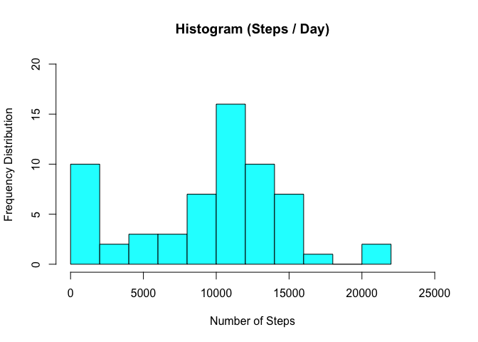
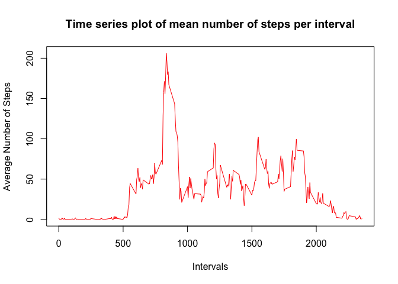
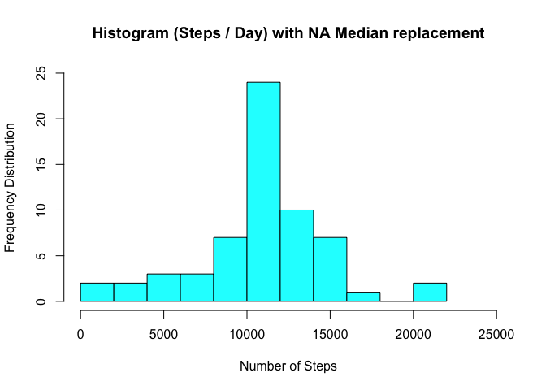
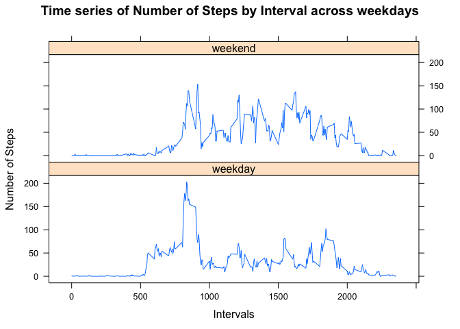

# Reproducible Research: Peer Assessment 1

#### Load libraries:

```r
library(dplyr)
```

```
## 
## Attaching package: 'dplyr'
## 
## The following objects are masked from 'package:stats':
## 
##     filter, lag
## 
## The following objects are masked from 'package:base':
## 
##     intersect, setdiff, setequal, union
```

```r
library(lubridate)
```

```
## Warning: package 'lubridate' was built under R version 3.2.3
```

```r
library(ggplot2)
library(lattice)
library(chron)
```

```
## 
## Attaching package: 'chron'
## 
## The following objects are masked from 'package:lubridate':
## 
##     days, hours, minutes, seconds, years
```

## Loading and preprocessing the data

Show any code that is needed to

1. Load the data (i.e. read.csv() )

2. Process/transform the data (if necessary) into a format suitable for your analysis


```r
#setwd("~/Desktop/RepData_PeerAssessment1")
amd_raw <- read.csv("activity.csv", colClasses = c("numeric", "character", "integer"))
amd <- data.frame(amd_raw)
str(amd)
```

```
## 'data.frame':	17568 obs. of  3 variables:
##  $ steps   : num  NA NA NA NA NA NA NA NA NA NA ...
##  $ date    : chr  "2012-10-01" "2012-10-01" "2012-10-01" "2012-10-01" ...
##  $ interval: int  0 5 10 15 20 25 30 35 40 45 ...
```

```r
summary(amd)
```

```
##      steps            date              interval     
##  Min.   :  0.00   Length:17568       Min.   :   0.0  
##  1st Qu.:  0.00   Class :character   1st Qu.: 588.8  
##  Median :  0.00   Mode  :character   Median :1177.5  
##  Mean   : 37.38                      Mean   :1177.5  
##  3rd Qu.: 12.00                      3rd Qu.:1766.2  
##  Max.   :806.00                      Max.   :2355.0  
##  NA's   :2304
```

```r
## convert charater date to Date Format:
amd$date <- ymd(amd$date)
```

## What is mean total number of steps taken per day?

For this part of the assignment, you can ignore the missing values in the dataset.

1. Calculate the total number of steps taken per day:


```r
##=============== One way to calculate steps/day:
amd_bydate<- group_by(amd, date)
stps_day <- summarize(amd_bydate, steps = sum(steps))
stps_day
```

```
## Source: local data frame [61 x 2]
## 
##          date steps
##        (time) (dbl)
## 1  2012-10-01    NA
## 2  2012-10-02   126
## 3  2012-10-03 11352
## 4  2012-10-04 12116
## 5  2012-10-05 13294
## 6  2012-10-06 15420
## 7  2012-10-07 11015
## 8  2012-10-08    NA
## 9  2012-10-09 12811
## 10 2012-10-10  9900
## ..        ...   ...
```

```r
##=============== Or this other way, ignoring missing values (NAs):
amd_sumstps <- aggregate(amd$steps, list(amd$date), sum, na.rm =TRUE)
colnames(amd_sumstps) <- c("date","steps")
head(amd_sumstps, 12L)
```

```
##          date steps
## 1  2012-10-01     0
## 2  2012-10-02   126
## 3  2012-10-03 11352
## 4  2012-10-04 12116
## 5  2012-10-05 13294
## 6  2012-10-06 15420
## 7  2012-10-07 11015
## 8  2012-10-08     0
## 9  2012-10-09 12811
## 10 2012-10-10  9900
## 11 2012-10-11 10304
## 12 2012-10-12 17382
```

```r
## ========================== Or this way (total overkill):
# split_data <- split(amd, amd$date)
# sum_of_steps <- data.frame(sapply(split_data, 
#                                   function(x) sum(x$steps, 
#                                                   na.rm = TRUE)))
# colnames(sum_of_steps) <- 'steps'
# hist(sum_of_steps$steps,
#      breaks = 10,
#      main = 'Histogram (Steps/Day)',
#      xlab = 'Steps')
##========================================================
```

2. Make a histogram of the total number of steps taken each day


```r
hist(amd_sumstps$steps, 
     breaks = 8, 
     ylim = c(0,20),
     xlim = c(0,25000),
     col = "cyan",
     xlab='Number of Steps', 
     ylab='Frequency Distribution', 
     main='Histogram (Steps / Day)')
```

 

```r
##================= This would be the code for a BarPlot of Steps/Day:
# barplot(stps_day$steps, 
#         names.arg = stps_day$date, 
#         ylim = c(0, 25000),
#         las = 3, 
#         cex.names = .4,
#         xlab = "Day of the Month",
#         ylab = "Number of Steps")
```

3. Calculate and report the mean and median of the total number of steps taken per day:


```r
##================ Not ignoring "NAs":
summary(stps_day)
```

```
##       date                steps      
##  Min.   :2012-10-01   Min.   :   41  
##  1st Qu.:2012-10-16   1st Qu.: 8841  
##  Median :2012-10-31   Median :10765  
##  Mean   :2012-10-31   Mean   :10766  
##  3rd Qu.:2012-11-15   3rd Qu.:13294  
##  Max.   :2012-11-30   Max.   :21194  
##                       NA's   :8
```

```r
##================ Ignoring "NAs":
summary(amd_sumstps)
```

```
##       date                steps      
##  Min.   :2012-10-01   Min.   :    0  
##  1st Qu.:2012-10-16   1st Qu.: 6778  
##  Median :2012-10-31   Median :10395  
##  Mean   :2012-10-31   Mean   : 9354  
##  3rd Qu.:2012-11-15   3rd Qu.:12811  
##  Max.   :2012-11-30   Max.   :21194
```

## What is the average daily activity pattern?

1. Make a time series plot (i.e. type = "l" ) of the 5-minute interval (x-axis) and the average number of
steps taken, averaged across all days (y-axis)


```r
mstps_pinterval <- aggregate(steps ~ interval, amd, mean)
plot(mstps_pinterval, 
     type='l', 
     xlab = "Intervals", 
     ylab = "Average Number of Steps", 
     main = "Time series plot of mean number of steps per interval",
     col ="red")
```

 

2. Which 5-minute interval, on average across all the days in the dataset, contains the maximum number
of steps?


```r
mstps_pinterval$interval[which.max(mstps_pinterval$steps)]
```

```
## [1] 835
```


## Imputing missing values

1. Calculate and report the total number of missing values in the dataset (i.e. the total number of rows
with NA s)


```r
sum(is.na(amd$steps))
```

```
## [1] 2304
```

2. Devise a strategy for filling in all of the missing values in the dataset. The strategy does not need to be
sophisticated. For example, you could use the mean/median for that day, or the mean for that 5-
minute interval, etc.

3. Create a new dataset that is equal to the original dataset but with the missing data filled in.


```r
stps_day$steps[is.na(stps_day$steps)] <- median(stps_day$steps, na.rm = TRUE)
stps_day
```

```
## Source: local data frame [61 x 2]
## 
##          date steps
##        (time) (dbl)
## 1  2012-10-01 10765
## 2  2012-10-02   126
## 3  2012-10-03 11352
## 4  2012-10-04 12116
## 5  2012-10-05 13294
## 6  2012-10-06 15420
## 7  2012-10-07 11015
## 8  2012-10-08 10765
## 9  2012-10-09 12811
## 10 2012-10-10  9900
## ..        ...   ...
```

```r
# ==================== Alternative way:
# stps_day <- transform(stps_day, 
#                       steps = ifelse(is.na(steps), 
#                                      mean(steps, na.rm=TRUE), 
#                                      steps))
# stps_day
```

4. Make a histogram of the total number of steps taken each day and Calculate and report the mean and
median total number of steps taken per day.


```r
hist(stps_day$steps, 
     breaks = 8, 
     ylim = c(0,25),
     xlim = c(0,25000),
     col = "cyan",
     xlab='Number of Steps', 
     ylab='Frequency Distribution', 
     main='Histogram (Steps / Day) with NA Median replacement')
```

 

Do these values differ from the estimates from the first
part of the assignment? What is the impact of imputing missing data on the estimates of the total daily
number of steps?

Yes. There's a big difference now that the missing values are replaced with the median per day value, see below:


```r
summary(stps_day)
```

```
##       date                steps      
##  Min.   :2012-10-01   Min.   :   41  
##  1st Qu.:2012-10-16   1st Qu.: 9819  
##  Median :2012-10-31   Median :10765  
##  Mean   :2012-10-31   Mean   :10766  
##  3rd Qu.:2012-11-15   3rd Qu.:12811  
##  Max.   :2012-11-30   Max.   :21194
```

## Are there differences in activity patterns between weekdays and weekends?

1. Create a new factor variable in the dataset with two levels – “weekday” and “weekend” indicating
whether a given date is a weekday or weekend day.


```r
## Create a new data frame with NAs replaced with the median "steps" value:

amd_noNAs <- amd
amd_noNAs$steps[is.na(amd_noNAs$steps)] <- median(amd_noNAs$steps, na.rm = TRUE)

## ====================== Using "chron" library:
## Create the new variable, "daytype":

amd_noNAs$daytype  <- as.factor(ifelse(is.weekend(amd_noNAs$date), 
                                       "weekend", 
                                       "weekday"))
str(amd_noNAs)
```

```
## 'data.frame':	17568 obs. of  4 variables:
##  $ steps   : num  0 0 0 0 0 0 0 0 0 0 ...
##  $ date    : POSIXct, format: "2012-10-01" "2012-10-01" ...
##  $ interval: int  0 5 10 15 20 25 30 35 40 45 ...
##  $ daytype : Factor w/ 2 levels "weekday","weekend": 1 1 1 1 1 1 1 1 1 1 ...
```

```r
## ====================== Alternatively, using base R:

# date_wd <- weekdays(amd_noNAs$date)
# date_we <- date_wd == "Sunday" | date_wd == "Saturday"
# amd_noNAs$day_type <- factor(as.integer(date_we),
#                             levels = c(0, 1),
#                             labels = c("weekday", "weekend"))
```

2. Make a panel plot containing a time series plot (i.e. type = "l" ) of the 5-minute interval (x-axis) and
the average number of steps taken, averaged across all weekday days or weekend days (y-axis). 


```r
wdays_stps <- aggregate(steps ~ interval + daytype, FUN="mean", data = amd_noNAs)

xyplot(steps ~ interval | daytype, 
       data = wdays_stps,
       layout = c(1, 2),
       xlab = 'Intervals', 
       ylab = 'Number of Steps',
       main = "Time series of Number of Steps by Interval across weekdays",
       type = 'l')
```

 


